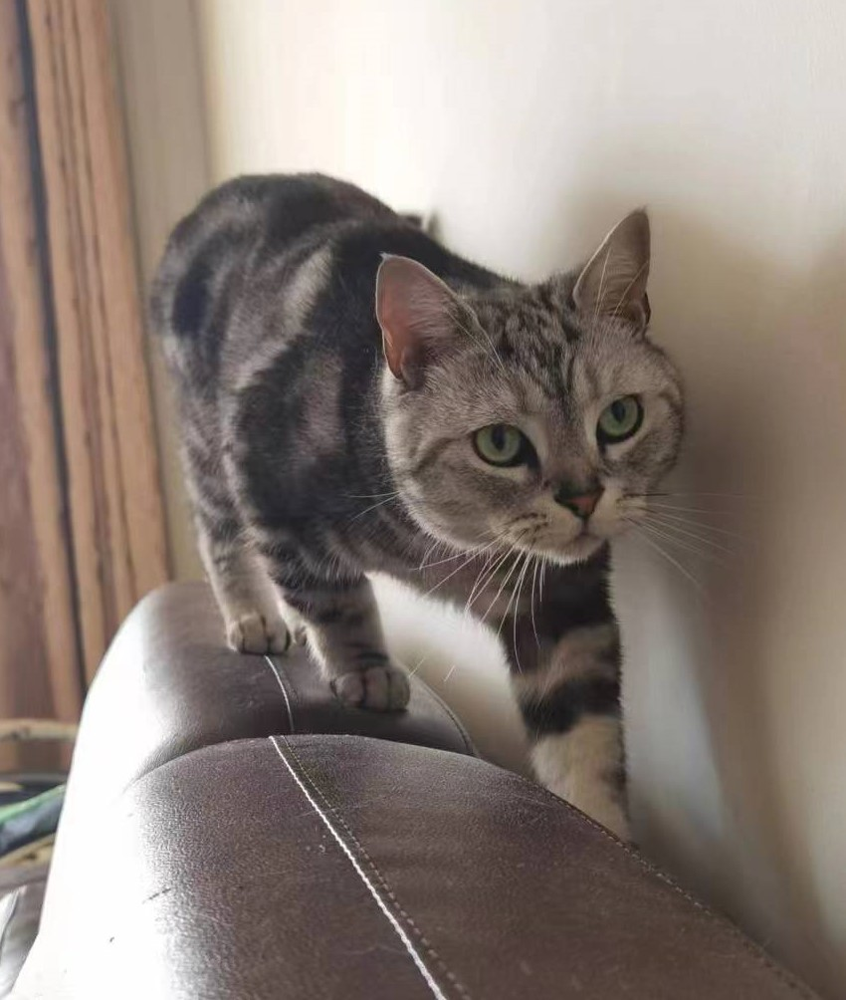
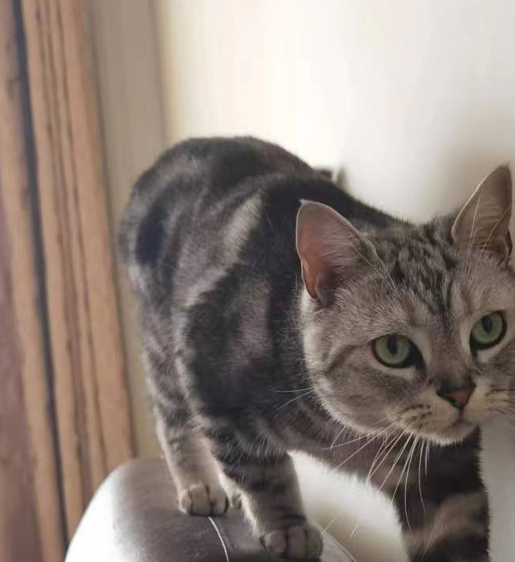
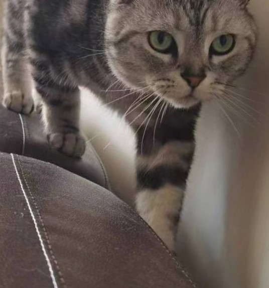
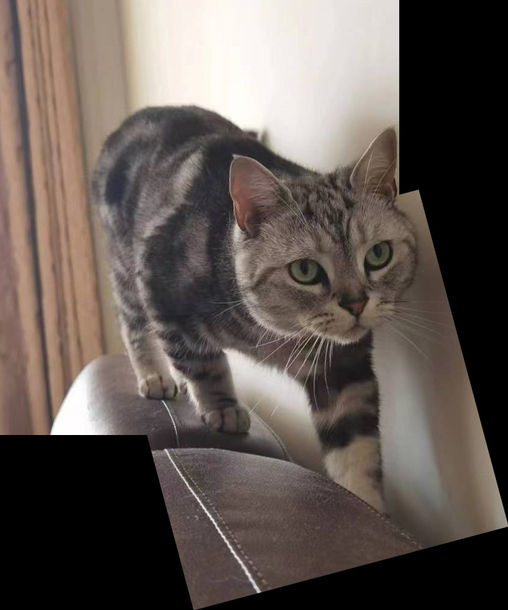

# image_stitch: 基于特征匹配的图像拼接
## 使用
  - ```image_stitch.py```接受三个文件名，以及一个可选的```-g(--gray_scale)```作为参数。前两个文件名为用于拼接的两个图像，第三个文件名为拼接后的输出图像。若提供```-g(--gray_scale)```参数，则输出图像为灰度图像（例如8位bmp图像）
## 实现
  - 使用```SIFT```对两张图提取特征点，用```BFMatcher```的```KNN```算法寻找匹配，使用```Lowe's```算法筛选匹配点，依据匹配计算出变换矩阵，对第二张图做透视变换并使用```np.putmask```做简单的图像拼接。
## 示例
- 原始图像<br /><br />从原始图像中截取的两部分，其中一张图进行了一定的旋转<br />


<br />拼接后的输出结果：<br />
